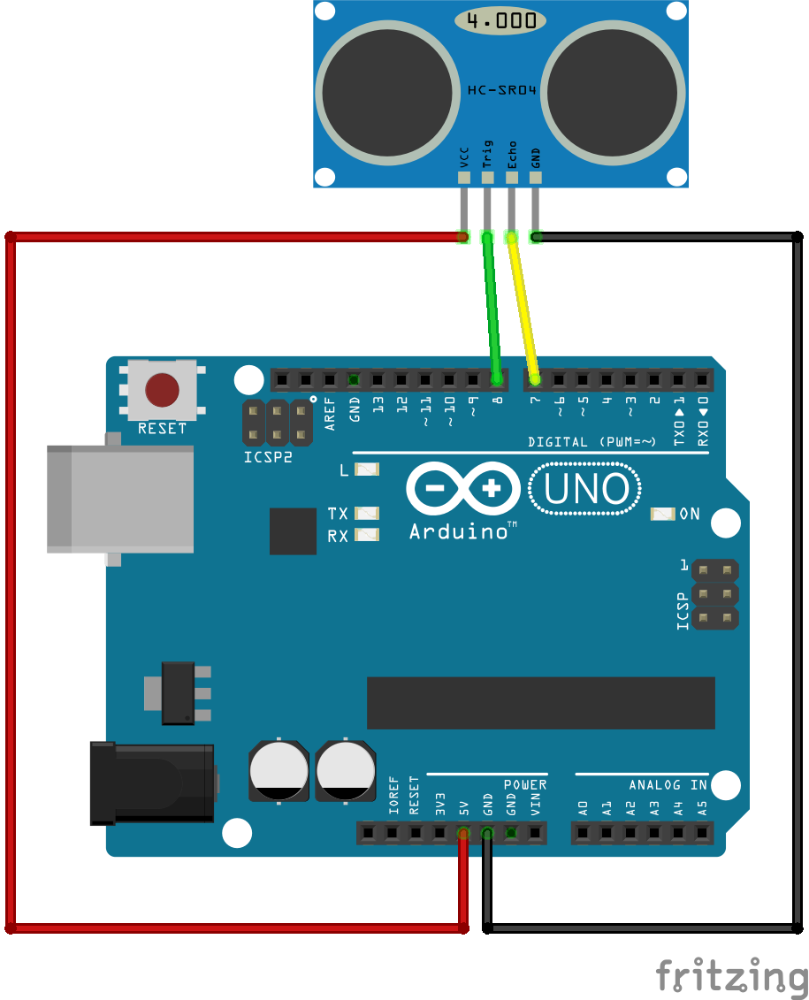

# Ultrasonic
Vi har 4 styk [HC-SR04 ultrasonic sensorer](https://www.amazon.com/SainSmart-HC-SR04-Ranging-Detector-Distance/dp/B004U8TOE6).

## Fordele og ulemper ved ultrasonic range finders
http://www.ab.com/en/epub/catalogs/12772/6543185/12041221/12041229/Ultrasonic-Advantages-and-Disadvantages.html#

Fungerer bedst med flade hårde overflader der er vinkelrette på sensoren.
Fungerer dårligt med bløde overflader der sluger lyd og dårligt med hårde flader der ikke er vinkelrette da de reflekterer lyden videre.

## Opsætning
sensoren har 4 ben.

* jord/gnd
* trigger pin: udløs forespørgsel
* echo pin: modtag svar
* 5V

```
#include <NewPing.h>
 
#define TRIGGER_PIN  7
#define ECHO_PIN     8
#define MAX_DISTANCE 200
 
NewPing sonar(TRIGGER_PIN, ECHO_PIN, MAX_DISTANCE);

void setup() {
  Serial.begin(115200);
}
 
void loop() {
  delay(50);
  int uS = sonar.ping();
  Serial.print("Ping: ");
  Serial.print(uS / US_ROUNDTRIP_CM);
}
```



